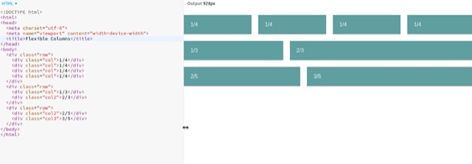
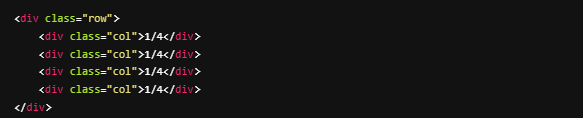
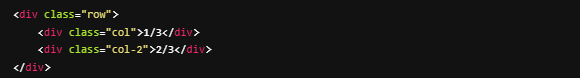
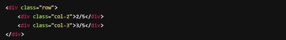

# FLEX-ible Columns
Using what we've learned about the flex property, recreate the following column system by making the following CSS classes:

- `.row`
- `.col`
- `.col-2`
- `.col-3`

## Part I
Using the HTML provided below create the `.row` class and the `.col` class inside of our **CSS** to create the layout with **4 evenly spaced** boxes

## Part II
Using the **HTML** provided below and *reusing* the `.row` and `.col` classes from before, create a .`col-2` class inside of our **CSS**. We want it to appear as a **1/3 of the space box** and a **2/3 of the space box.**

## Part III
Using the **HTML** provided below and *reusing* the `.row` and `.col-2`, classes from before, create a `.col-3` class inside of our **CSS**. We want it to appear as a layout with a **2/5 of the space box and a 3/5 of the space box.**

- [x] Recreate the first row with evenly spaced columns

- [x] Recreate the second row with a **1/3 width and 2/3 width column**

- [x] Recreate the third row with a **2/5 width and 3/5 width column**

Here is how mine turned out in example below. 